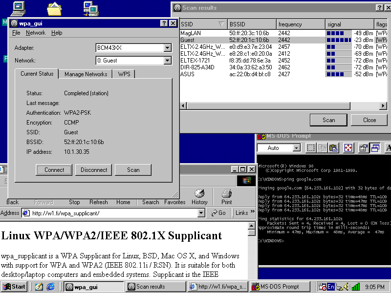
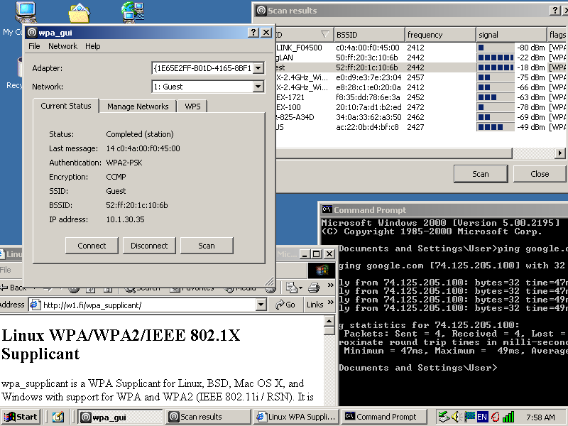

# wpa_supplicant for Windows

## Description

wpa_supplicant has support for being used as a WPA/WPA2/IEEE 802.1X Supplicant on Windows. Last official build for Windows 98 was [0.4.11](http://w1.fi/releases/wpa_supplicant-windows-bin-0.4.11.zip) (2008-12-03) and last official build for Windows 2000 and later was [0.7.3](http://w1.fi/releases/wpa_supplicant-0.7.3.exe) (2010-09-07). This port aims to restore functionality of modern versions of wpa_supplicant on older versions of Windows such as Windows 98, Windows 2000, Windows XP SP2, etc.

Currently, there are several different build configurations with different features.

Builds with `WPAS_CTRL_IFACE=pipe`:
* Official way to use wpa_supplicant on Windows platform
* All tools supported: `win_if_list`, `wpa_passphrase`, `wpa_supplicant`, `wpasvc`, `wpa_cli`, `wpa_gui`
* Not compatible with Windows 98

Builds with `WPAS_CTRL_IFACE=udp`:
* Extremely unstable, can be used only for testing purposes
* All tools supported: `win_if_list`, `wpa_passphrase`, `wpa_supplicant`, `wpasvc`, `wpa_cli`, `wpa_gui`
* Compatible with Windows 98 in theory

Builds with `WPAS_CTRL_IFACE=standalone`:
* Experimental way, `wpa_gui` built with bundled `wpasvc` instance without IPC
* Partial tools support: only `win_if_list`, `wpa_passphrase`, `wpa_supplicant` and `wpa_gui`. While `wpasvc` can be used as headless service or as debugging app, `wpa_cli` is completely broken
* Compatible with Windows 98

## Requirements

Build requirements:
* CMake 3.15 or later
* Microsoft Visual Studio 2005
* Qt 4.4.3 ([static msvc2005 build](https://fami-net.no-ip.org/mirrors/qt/unofficial_builds/qt4.4.3-msvc2005-static/msvc2005_static_lite01.7z))

Run requirements:
* [WinPcap 3.1](https://www.winpcap.org/archive/3.1-WinPcap.exe) for Windows 9x or [WinPcap 4.1.3](https://www.winpcap.org/install/bin/WinPcap_4_1_3.exe) for Windows 2000 and later

## Screenshots

## Links
* wpa_supplicant homepage: <https://w1.fi/wpa_supplicant/>
* wpa_supplicant releases page: <http://w1.fi/releases/>
* WinPcap homepage: <https://www.winpcap.org/>
* WinPcap archive page: <https://www.winpcap.org/archive/>
* "Does wpa_supplicant work on Win98?" mailing list thread: <http://lists.infradead.org/pipermail/hostap/2008-July/018043.html>
